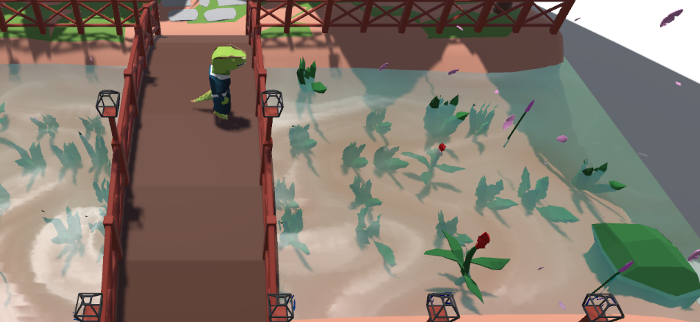

# Document page

This page contains various documents related to the game project.

Available files:

- **equipment-system**: Explanation for how some script related to equipment works.
- **technical-note**: Memo about important details in our game code, scene structure,..

## Trello pages

<https://trello.com/b/018deasK/game-project-gr30>

<https://trello.com/invite/b/018deasK/8536e3afc42fae564fc625c9177be8b5/game-project-gr30>

## Basics of the game

Jho's vengeance is centred around Jho, our Dino protagonist, living in the cyberpunk-esque future in Japan-Gea, on his quest for vengeance against those who killed his father.
He must battle his way through enemies to continue on his quest to kill Lord Long-Neck, who lives in the cyber-facility near Jho's peaceful village.

Combat is simple - left click to attack, right click to parry attacks, 'e' to pick up objects, 'f' to fire projectiles, 'q' to switch equipped weapons
and space to dash in the direction of the mouse. To access the inventory UI, press 'tab'. Hover over images in the inventory to see a tooltip.

There is a tutorial level that explains this system firsthand.

## Objects and entities

We created custom assets in Blender, for example the Sakura trees and the Zen Garden respawn area were created in Blender before importing as separate FBX files to be used in Unity. The player and enemy models were our own design, as well as headwear (hats) and the default starter katana and shurikens. Each model has a generic armature with inverse kinematics. This armature was then used to create unique animations by moving the character in Blender and keyframing each motion to make a complex movement. Such as walk, run, idle, block, various attacks & combos, revive and more. Static objects created like the Sakura trees and water were given custom leaf particle systems and water shaders. A simple and small palette was used to UV map colours to our assets. Once vertexes were scaled down on the map, we could essentially click and paint the faces of our models. Automatic weights and weight painting was also used to minimise model distortion and clipping while in movement.

For enemies, we design them using 2 interfaces: `IEnemy` which govern enemy's stat and their status, and `IEnemyAI` which control their AI and animation state. Every enemy has their own scripts such as `MeleeSoldier` and `MeleeSoldierAI` which are implementation of the above 2 files.

For player, we control them and track data belong to them through several scripts: `PlayerController`, `PlayerStatHUD` and `InvetoryController`. The first one dictate how player move, how their react to their surroundings. The second one housed player's stat and basic HUD (health bar). The last one, exactly like it name said, keep track of player inventory.

## ASSETS WE DID NOT CREATE

Assets stored in the 'AssetStore' folder have been imported and are not ours. This includes level assets like our the industrial/sci-fi walls and floors, items (which have been
moved to resources/prefabs/itemprefabs for convenience), park assets, etc.

In the shaders folder, there are 2 subfolders, OtherShaders and OurShaders; OtherShaders are shaders that are originally from imported assets, but have been modified slightly
for the purposes of the project.

Credit:
See root README References

## Shaders to be marked

### Shader 1 - HoverOutlinePhongEpic (Assets/Shaders/Our Shaders/HoverOutlinePhongEpic)


A basic, multi-pass shader which derives from our other custom shader 'OutlinePhongEpic', the shader has 3 passes to create the desired effect. It creates a 'shadow' around
the item, and then an outline around the item and its shadow. It is intended to be applied when an item of epic rarity is hovered by the mouse.

The first pass is the outline pass, in colour described by variable 'outline2', in width described by 'outlinewidth'. It works by taking each vertex and vertexNormal
to create an outline over the object.

- In the vertex shader, it takes each vertex, considers the shadow distance (as described in pass 2) and then adds (normalise(vertexNormal) \* outlinewidth) to the vertex and
  creates a v2f (vert to frag, sometimes fragVert in our shaders) object with SV_POSITION equal to the float4 described.
- In the fragment shader, it applies the colour described by 'outline2'

```cg
v2f vert(appdata v)
                {
                    float3 newPos = v.vertex.xyz * (_OutlineWidth + 1.2);
                    float3 normal = normalize(v.normal);
                    newPos += normal * _OutlineWidth;

                    v2f output;
                    UNITY_INITIALIZE_OUTPUT(v2f, output);
                    output.pos = UnityObjectToClipPos(newPos);
                    return output;
                }
```

The second pass is the 'shadow' pass, in colour described by variable 'outline'. It creates a shadow around the object to let players know that the item is an epic item.

- In the vertex shader, it takes each vertex and multiplies it to create a larger object, using the cull front declaration to make sure the item doesn't render over
  the original item.
- In the fragment shader, it applies the shadow colour

The third pass is the normal render pass, as described by the blinn-phong approximation model described in works.

Since this effect is shared with other epic items and the outline with other non-epic items, these passes can be found in shaders 'StandardOutline' and 'OutlinePhongEpic'
as well.

### Shader 2 - Water Shader - FlowingWater (Assets/Shaders/Our Shaders/FlowingWater.shader)



The water shader can be split into 2 stages.

One which is fully opaque and allows the water material to flow and directions like that of water.

It uses noise maps, texture maps and derivative maps.

- The noise map is used to give the water interesting flows, so it doesn't look rigid.
- The texture map unsurprisingly gives the water texture. The darker the texture the "deeper" the water, with the light parts representing the top of the wave.
- The derivative map allows the water to alter how it interacts with light.

As we can see the water shader has many different properties that can be adjusted to get the water to flow how we want it to.

```c#
Properties{
  _Color("Color", Color) = (1,1,1,1)
  _MainTex("Albedo (RGB)", 2D) = "white" {}
  [NoScaleOffset] _FlowMap("Flow (RG, A noise)", 2D) = "black" {}
  [NoScaleOffset] _DerivHeightMap("Deriv (AG) Height (B)", 2D) = "black" {}
  _Glossiness("Smoothness", Range(0,1)) = 0.5
  _Tiling("Tiling", Float) = 1
  _Speed("Speed", Float) = 1
  _FlowStrength("Flow Strength", Float) = 1
  _HeightScale("Height Scale, Constant", Float) = 0.25
  _HeightScaleModulated("Height Scale, Modulated", Float) = 0.75

 }
```

The modulated and constant height scale is used so that we can base the height of the waves on the strength of the flow of the water. Stronger flow of water = taller wave heights.

By splitting it up, we choose how much weight we put on the flow, in deciding the height at that point.

```c#
float finalHeightScale = flow.z * _HeightScaleModulated + _HeightScale;
```

For the second stage we turn the material transparent, added fogginess and refraction. This can be customized too using these new properties:

```c#
Properties{

  _WaterFogColor("Water Fog Color", Color) = (0, 0, 0, 0)
  _WaterFogDensity("Water Fog Density", Range(0, 2)) = 0.1
  _RefractionStrength("Refraction Strength", Range(0, 1)) = 0.25
 }
```

By implementing a grabPass, we can see through the plane and grab the colour behind it, we then add fog depending on the density and depth and return am interpolation of the colour

```c#
  GrabPass { "_WaterBackground" }

  float3 backgroundColor = tex2D(_WaterBackground, uv).rgb;

  float fogFactor = exp2(-_WaterFogDensity * depthDifference);

  return lerp(_WaterFogColor, backgroundColor, fogFactor);
```

By offsetting depending on the derivate map found in stage 1 and refraction strength input, we can create a fake refraction.

Both of these stages combined creates a material that both refracts and flows like water. It is used in our "ZenGarden " scene to reflect a passive riverbank with a boat on top.

The transparency and refraction are shown by seeing the underlying riverbed of stones, grass, and flowers.

## Particle system

The particle system that we used in our project was for the falling leaves out of the Sakura trees.


This can be found in the “ZenGarden” or the respawn/start room. Falling Sakura leaves, although stereotypical/cliché, are a simple way to converse to the player that Jho is in Japan (Japan-gea).
That is why we decided to make this particle system.

The idea is that the leaves will “fall out” of the tree, and while falling they will be blown by the wind, pushing their path around randomly and spinning the leaves.
This was constructed by creating a new particle system.
Set the renderer to emit `flower1` mesh, with Sakura leave material, so that that particle is a pink leaf. Using starting rotation intervals and starting size intervals to make each leaf a little different.
Cone shape, noise, particle speed, timing between particles are set to change over time to make the particle system realistic.

“Unity Tutorial: Falling Leaves Particle System” by LMHPOLY\*, was used as a guide when constructing the particle system.
We used a mesh for our leaves, instead of a 2d sprite. This was done because Tymara had created a 3d model for the leaves and we also believed it was visually more impressive.
It also fits very well into the low-poly design of our game and the “ZenGarden” especially.

## Procedural Generation

The mesh procedural generation we used in our game was for one of the boss's abilities.

Its script can be located in `Assets\Scripts\ProceduralGenerate\ProcGenBoulder.cs` and its prefab in `\Assets\Resources\Prefabs\Enemy\FallingBoulder`.

It's a function that generated boulder-shaped object and earthquake-like fracture shape, depend on the parameters.


First, I created an icosphere with 12 vertices and 20 triangles. Then I subdivided (number of division is controlled by `nDivision` variable) them to increase the vertices count. After that, I used Unity built-in Perlin noise map to randomly displace the vertex in the direction of its normal. How much they displaced are depend on `randomMagnitude` variable.

```csharp
foreach (Vector3 vertex in verticeList)
{
    Vector3 normal = vertex.normalized;
    float randomNumber = Random.Range(0, 100);
    float noiseValue = Mathf.PerlinNoise(normal.x * randomNumber, normal.y * randomNumber);
    Vector3 newVertex = vertex + (noiseValue * randomMagnitude * normal);
    noiseVerticeList.Add(newVertex);
}
```

Finally, I duped the vertices by a multiplier of 3 and assign each group of three vertices (a triangle) the same normal to created a flat shading look (meaning the mesh renderer will use "triangle surface normal" instead of individual vertex normal).

```csharp
foreach (Triangle triangle in triangleList)
{
    Vector3 v1 = noiseVerticeList[triangle.a];
    Vector3 v2 = noiseVerticeList[triangle.b];
    Vector3 v3 = noiseVerticeList[triangle.c];

    Vector3 triangleNormal = Vector3.Cross((v2 - v1), (v3 - v1));
    finalVerticeList.Add(v1);
    finalVerticeList.Add(v2);
    finalVerticeList.Add(v3);
    normalsList.Add(triangleNormal);
    normalsList.Add(triangleNormal);
    normalsList.Add(triangleNormal);
}

triangles = new int[finalVerticeList.Count];
for (int i = 0; i < finalVerticeList.Count; i++)
{
    triangles[i] = i;
}
```

## Camera motion

Our camera motion is handled by the CameraFollow script in the SmoothCamera prefab. It works by finding the transform of the player and offsetting from its position by
the floats height and zOffset. It is a top-down camera model, and as such our maps out created so that walls with z-coordinates between the camera offset and the player
are invisible to prevent obstructing the player's view.

```c#
 Vector3 pos = new Vector3();
        pos.x = player.position.x;
        pos.y = player.position.y + height;
        pos.z = player.position.z + zOffset;
        transform.position = Vector3.SmoothDamp(transform.position, pos, ref velocity, smooth);
```

It also uses float 'smooth' to move to its new location more slowly (greater 'smooth' value, slower 'snapping' of the camera) to prevent jarring camera movement, which
may make the player disoriented, dizzy, etc.

It provides game effects like camera shaking when the player slams the ground during his combo move, or when the boss roars.

## Graphics pipeline

Graphics pipelines dictate how we want our project to be rendered. As different pipelines are suited towards different test cases, we had to decide which would suit us most.

Firstly, the Standard Render Pipeline (SRP). This pipeline is in-built in unity and doesn't need to be installed via the package manager. This works for all cases, and we had no issue with it.

As we aren't using any crazy triple AAA techniques and are using very simple small maps, High-Definition Render Pipeline (HDRP) would be overkill and unnecessary for us.

The purpose of the Universal render pipeline is clear in its name. It is a step up from SRP as it has more features such as shader subgraphs, but it still needs to be installed via the package manager.

Although the SRP doesn't have flashy additions nor can it be optimised for us and the project, we didn't need to change pipeline to the perfectly viable URP to get our project running. As such we stuck with the SRP.

# Feedback evaluation

## Observational Method

We chose a post-game talk/interview as our observational method. Players were told to play through the game as they normally would any basic combat game, and describe
their experience and observations afterwards. Players were not aided during the gameplay (unless the game was bugged) but were observed. Notes were taken both on the
player's gameplay during the testing, and on their comments afterwards. The post-game questions afterwards were based on their gameplay, with a few universal questions
throughout ("Did you enjoy the game?", "Was the boss hard?", "Did you enjoy the combat?", etc.)

### Demographic

Our demographic consisted of an even split of women and men, with the majority having experience in game-testing or just playing games in general.
The overwhelming majority of our testers were young adults between 18 and 25. We preferred this demographic to the more broad
demographic of the querying technique as we thought the greater experience would mean the testers would easier be able to recall their gameplay in more detail,
while we left simpler, more concise questions for the questionnaire.
We have 7 interviewees overall, with only one not having moderate experience playing games nor coding them. 2 had experience in game development,
specifically on the Unreal Engine, and the others all with experience in video games.

### Feedback received/Observations

Popular comments:

- The stairs in ZenGarden made it look like the player was supposed to go outside (while in fact the player should not).

- Some yellow squares on map confused the player. These are spots we spawn enemies and left them there to debug easier.

- 'The cursor was hard to see'

Observations

- Many players skipped the tutorial, sometimes causing them to miss information on projectiles, weapon switching, etc.

- Experienced players were quick to exploit mechanics to make the game easier (stun locking, dash spamming)

## Querying Technique

We chose to use a questionnaire as our querying technique. We had players play the game to as close as they could get to completion. Again, they were only
aided if necessary or if there were technical issues. A brief description and some story contexts were given. We used a google form to write questions and
collect appropriate data. Our questionnaire was anonymous.

### Demographic


Our demographic was again mostly 18–25-year-olds. While it is good to have more variety for useful statistics, the target audience for a game like ours is likely to be
in a similar age range, so these results are significant.
We had 13 responses to our questionnaire. They were less experienced gamers by percentage and also no game-development experience in the group.

### Feedback/Results

We found an extremely even spread perceived difficulty and time-for-completion, with the slight majority finishing the game between 15-30 minutes.
Some players found the boss quite hard, others put it at a '1/10' (see below) for difficulty. Most players rated the boss between 6/10-9/10 for difficulty, which is
ideal for an easy-to-pick-up rogue fighter game. The player base also seemed to think that the smaller mobs were of moderate-low difficulty, which perhaps could be scaled
in a later release as they are an integral part of gameplay.


It was extremely useful to have players write out their bugs in the survey for identifying and fixing errors.

No performance issues (lag, frame drop) were found in this group.

Perceived engagement was good. Players seemed to enjoy the art style and level lighting, especially the enemy assets made by us. All players said 'yes' to playing a
later beta release or the final product. Despite being non-required answers, all testers provided input for improvements and features they'd like to see.

## Post-Evaluation Improvements and Bug Fixes

#### Game balancing

- Ultra-strong items were spawning due to the stat cap for all items being the same. Offense and defence items were given their own respective maximums based on how 'good' we deemed the items should be.

- Projectiles were too fast and could easy stop charges of our charging enemies and stun lock other mobs. We increased the cooldown between throws.

- Players find using projectiles against boss is easier than melee attack them. So, we improved the attack animation, allows the player slightly easier time to dodge or block attack. In addition, we also give the boss a new ranged attack that are useful against ranged player.

#### UI and Visibility

- Testers complained of difficulty tracking the mouse. The cursor was made bigger to accommodate for this feedback.

- Testers were confused by the yellow tiles we used to signify a spawn area for enemies in testing. We patched this.

- Experienced gamers expected the inventory overlay to be escapable via the 'esc' key. We added this to the list of binds.

- Players struggled to pick up smaller items. We increased the items' click-hitboxes and their general size.

- Players complained about have to pickup items and compare their stat in inventory. We added another tooltip whenyou hover cursor over the item in world space.

#### Bugs

- Boss monster did get 'stuck' (unable to move or rotate) in some circumstances. We patched out this behaviour.

- Some items did float through objects. Patched out this behaviour

#### Other

- Some players would move into the indefinite space beside our respawn scene. We added limits to the scene to prevent plays from doing that.

- Players wanted a victory screen, or some similar object upon beating the boss. We incorporated a score/total damage count and an overlay with some buttons.

- Added music volume and sound effect volume options as request from players.

## Member contributions

### Lam Nguyen Khoa

Combat mechanic:

- Attack, combo, parry, guard, dash.
- Damage popup when enemies are hurt.
- Interactions between player and enemy entities.
- Blood particles.
- Slash effect particles.
- Damaged health bar effect.

Boss AI

Level structure:

- Triggers that send player to next map.
- How data transfer between scene.
- What object need to present in each level, which should be DontDestroyOnLoad to keep the level working well and easy to test.

Feedback gathering.

Start scene and Ending scene.

### Tymara Metcalf

Modeling:

- Character design
- Weapon design
- Map/Level Design
- UI

Animation:

- Character motion, rigging, and skinning

Video Editing

Beta Testing Evaluations

Logo

### Sebastian Davey Gargano

Inventory system including:

- Weapons, armour, food and some projectiles and their game logic script (except for the throwing of projectiles, which was completed by Lam)
- Item drop logic and drop probability
- Random item stats
- Item materials and changing item materials based on game logic
- Inventory overlay

Marked shader 1 and all its variants

The tutorial level and the tutorial help-text logic

### Zac Burns

- Enemy AI
- Water shader
- Map Designs
- Menu Screens
- Audio Mixing
- Feedback and evaluation gathering
